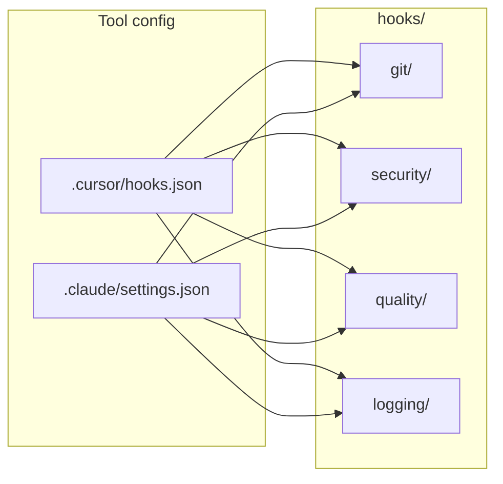

# Agent Hooks Instructions

## Overview

The `hooks/` directory holds **shared agent hook scripts** for Cursor and Claude Code. Hooks observe or control the agent loop: block unsafe git commands, block secret file reads (Cursor), format/lint after edits, and log debug events. Scripts are tool-agnostic; wiring lives in [`.cursor/hooks.json`](../.cursor/hooks.json) and [`.claude/settings.json`](../.claude/settings.json).

Guardrails enforced here mirror [`.cursor/rules/core/guardrails.mdc`](../.cursor/rules/core/guardrails.mdc) and [`.claude/rules/core/guardrails.md`](../.claude/rules/core/guardrails.md).

## Structure

```
hooks/
├── git/                    # Shell command guards (beforeShellExecution / PreToolUse)
│   ├── guard-destructive-git.sh
│   ├── guard-secret-commit.sh   # FAILS CLOSED
│   └── guard-worktree-clean.sh  # Claude Stop
├── security/               # File and query guards
│   ├── guard-protected-path.sh  # Claude PreToolUse on edits (write side)
│   ├── guard-readonly-sql.sh    # Claude PreToolUse from db-reader frontmatter; FAILS CLOSED
│   └── guard-secret-read.sh     # Cursor beforeReadFile / beforeTabFileRead (read side)
├── quality/                # Post-edit format + lint (afterFileEdit / PostToolUse)
│   ├── check-changed.sh         # Sequential entry point
│   ├── format-changed.sh        # ruff format (*.py)
│   ├── lint-changed.sh          # ruff check (*.py)
├── logging/                # Logs (fire-and-forget)
│   ├── session-start.sh         # Cursor sessionStart + Claude SessionStart
│   ├── instructions-loaded.sh   # Claude InstructionsLoaded (async)
│   ├── audit-bash.sh            # Claude PreToolUse Bash → audit trail
│   └── audit-config-change.sh   # Claude ConfigChange → audit trail
└── logs/                   # Git-ignored runtime output (Cursor/Claude debug only)
```

The **audit trail** is not in `logs/`. It goes to `~/.claude/audit/<project>/<date>.jsonl`, outside the repository, so `git clean -x` cannot remove it and it never enters a diff. Override with `CLAUDE_AUDIT_DIR`.

## Where to Change Things

| Task | Location |
|------|----------|
| Block a new git pattern | `git/guard-destructive-git.sh` or `git/guard-secret-commit.sh` |
| Block a new secret read pattern | `security/guard-secret-read.sh` (Cursor) + `permissions.deny` `Read(...)` (Claude) |
| Block a new secret write pattern | `security/guard-protected-path.sh` + `permissions.deny` `Edit(...)` |
| Constrain a tool's arguments for one agent only | that agent's `hooks.PreToolUse` in `.claude/agents/<name>.md`, e.g. `security/guard-readonly-sql.sh` |
| Change what the audit trail records | `logging/audit-bash.sh`, `logging/audit-config-change.sh` |
| Change format/lint behaviour | `quality/format-changed.sh` or `quality/lint-changed.sh` |
| Add Cursor hook wiring | [`.cursor/hooks.json`](../.cursor/hooks.json) |
| Add Claude hook wiring | [`.claude/settings.json`](../.claude/settings.json) → `hooks` |
| Session / instruction logs | `logging/*.sh` → `hooks/logs/` |
| Human overview | [README.md](README.md) |

## Wiring



Cursor paths are **relative to the repo root** (e.g. `hooks/git/guard-secret-commit.sh`). Claude paths use **exec form** with the `${CLAUDE_PROJECT_DIR}` placeholder: `"command": "sh"`, `"args": ["${CLAUDE_PROJECT_DIR}/hooks/…"]`. Never use a bare relative path in `.claude/settings.json`.

## Authoring Conventions

- **Shebang**: `#!/usr/bin/env sh` - POSIX shell; `jq` optional with `sed` fallback.
- **Project root**: `ROOT="${CURSOR_PROJECT_DIR:-${CLAUDE_PROJECT_DIR:-.}}"`
- **JSON input**: read stdin; support Claude (`.tool_input.*`) and Cursor (flat `command` / `file_path`).
- **Cursor allow/deny**: the shared git and secret-read guards print `{"permission":"allow"}` or `{"permission":"deny",...}` on stdout so `failClosed: true` never sees empty output. This is **Cursor's** contract — Claude Code ignores it.
- **Blocking**: exit `2` and only exit `2`. Claude Code treats exit `1` as a non-blocking error and runs the action anyway. Never rely on exit 1 to stop something.
- **Streams**: on exit 2 Claude discards stdout and feeds **stderr** back as the reason, so every block message must go to stderr (write it to both streams when the script is also used by Cursor). On exit 0 stdout is parsed as JSON — keep it empty unless you mean to emit `systemMessage` or, on the three injecting events, context.
- **Never inject by accident**: only `SessionStart`, `UserPromptSubmit` and `UserPromptExpansion` put stdout into the model's context. `logging/session-start.sh` is silent on stdout deliberately.
- **Post-tool feedback**: exit `2` reports lint problems but cannot undo an edit that already succeeded.
- **Stop hooks**: read `stop_hook_active` first and exit 0 when it is `true`. Claude Code overrides a Stop hook after eight consecutive blocks (`CLAUDE_CODE_STOP_HOOK_BLOCK_CAP`).
- **Failure posture**: two guards **fail closed**, because the action they gate is unrecoverable — `git/guard-secret-commit.sh` (staging a secret) and `security/guard-readonly-sql.sh` (a write executed against a database). Everything else fails open so missing developer tooling does not wedge the session. State the posture in each script's header.
- **Agent-scoped hooks**: a hook can also be wired from a subagent's own frontmatter (`hooks.PreToolUse`), which scopes it to that agent instead of the whole session — that is how `guard-readonly-sql.sh` is attached to `db-reader`. Reach for this when only one agent needs the constraint. Note a `PreToolUse` hook exiting 2 blocks the call *before* permission rules are evaluated, so it is the only way to constrain a tool's **arguments**; `tools` can only allow or deny the tool itself. `SubagentStart` cannot block.
- **Rules before hooks**: if a guarantee can be expressed as a `permissions.deny` rule, put it there. Deny rules are authoritative (a hook `allow` can never loosen them), cost nothing at runtime, and cover Bash file commands. Use a hook for what rules cannot express: parsed arguments, allowlist exceptions, audit trails, actionable reasons.
- **No scratch files in the working tree**: write runtime output to `hooks/logs/` (git-ignored) or, for anything durable, outside the repo.
- **Filenames**: kebab-case under category folders.

## Hook Behavior Summary

| Script | Trigger | Exit 2 when |
|--------|---------|-------------|
| `git/guard-secret-commit.sh` | Cursor `beforeShellExecution`; Claude PreToolUse Bash | Secret path named or in staged set, **or the guard cannot complete** |
| `git/guard-destructive-git.sh` | Cursor `beforeShellExecution`; Claude PreToolUse Bash | reset --hard, push --force, checkout --, etc.; **or a commit/push while HEAD is the default branch** (falls open when git cannot name the branch) |
| `git/guard-worktree-clean.sh` | Claude `Stop` | Non-ignored secret-looking files are loose in the tree |
| `security/guard-protected-path.sh` | Claude PreToolUse Edit\|Write\|NotebookEdit\|MultiEdit | Writing `.env`, keys, credentials, or a traversal path |
| `security/guard-readonly-sql.sh` | Claude PreToolUse on the DB query tool, wired from `.claude/agents/db-reader.md` frontmatter | Statement is not read-only, **or the guard cannot read it** |
| `security/guard-secret-read.sh` | Cursor `beforeReadFile` / `beforeTabFileRead` | Reading `.env*`, `*.pem`/`*.key`, credentials |
| `quality/check-changed.sh` | Cursor `afterFileEdit`; Claude PostToolUse Edit\|Write\|NotebookEdit | delegates sequentially to format, then lint |
| `quality/format-changed.sh` | called by `check-changed.sh` | never (always 0) |
| `quality/lint-changed.sh` | called by `check-changed.sh` | ruff reports problems on `.py` |
| `logging/audit-bash.sh` | Claude PreToolUse Bash | never (always 0) |
| `logging/audit-config-change.sh` | Claude `ConfigChange` | never (always 0) |
| `logging/session-start.sh` | Cursor sessionStart; Claude `SessionStart` | never |
| `logging/instructions-loaded.sh` | Claude `InstructionsLoaded` (async) | never |

## Debugging

| Log | Command |
|-----|---------|
| Session starts (both tools) | `tail -f hooks/logs/session-start.log` |
| Claude instruction load | `tail -f hooks/logs/instructions-loaded.log` |
| Bash + config audit trail | `tail -f ~/.claude/audit/api-template/$(date -u +%F).jsonl` |
| Cursor hook errors | Customize → Hooks output channel |
| Claude hook errors | `claude --debug`; `/hooks` for the effective set |

`hooks/logs/**` is denied by `permissions.deny` → `Read(...)`, so these are a **human** workflow: the agent cannot read them, deliberately, to keep noisy logs out of context.

## Contribution

- Edit scripts only under `hooks/` - do not duplicate under `.cursor/hooks/` or `.claude/hooks/`.
- When adding a hook, update [`.cursor/hooks.json`](../.cursor/hooks.json), [`.claude/settings.json`](../.claude/settings.json) (if applicable), [README.md](README.md), and this file.
- Align new guards with [guardrails](../.cursor/rules/core/guardrails.mdc); never weaken secret or destructive-git protection without explicit user approval.
- `chmod +x` new scripts before committing.
- Follow conventions in the root [AGENTS.md](../AGENTS.md).
